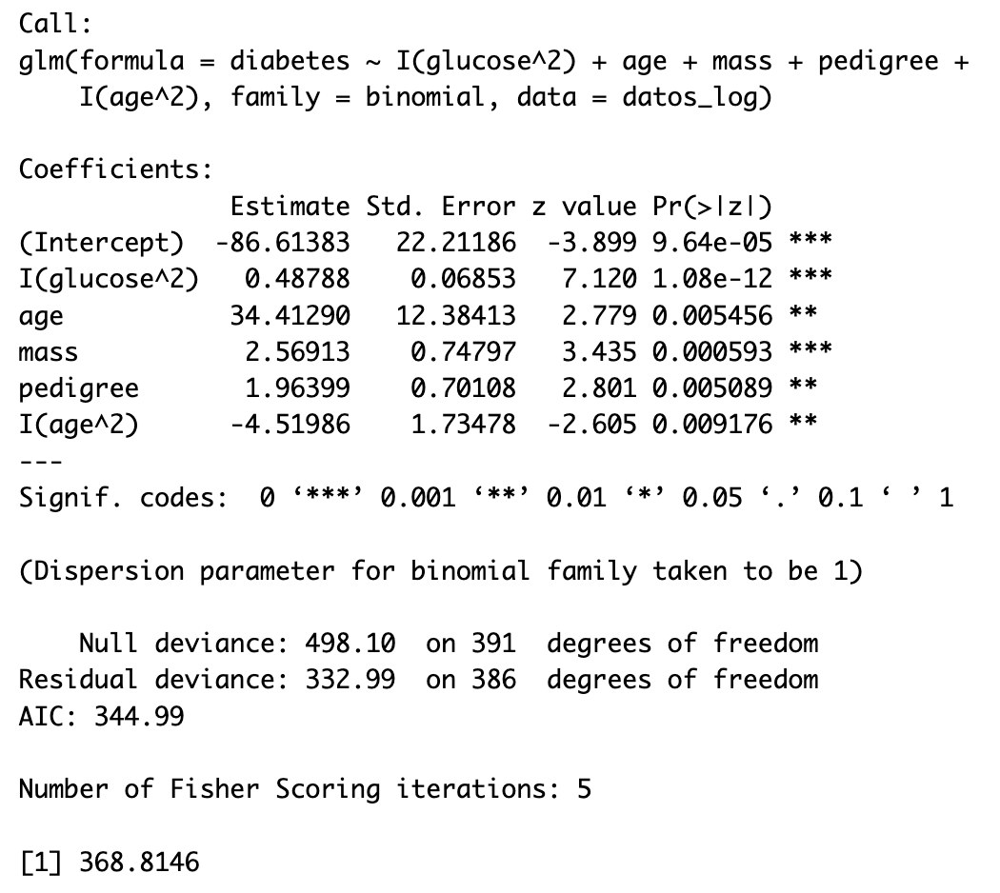
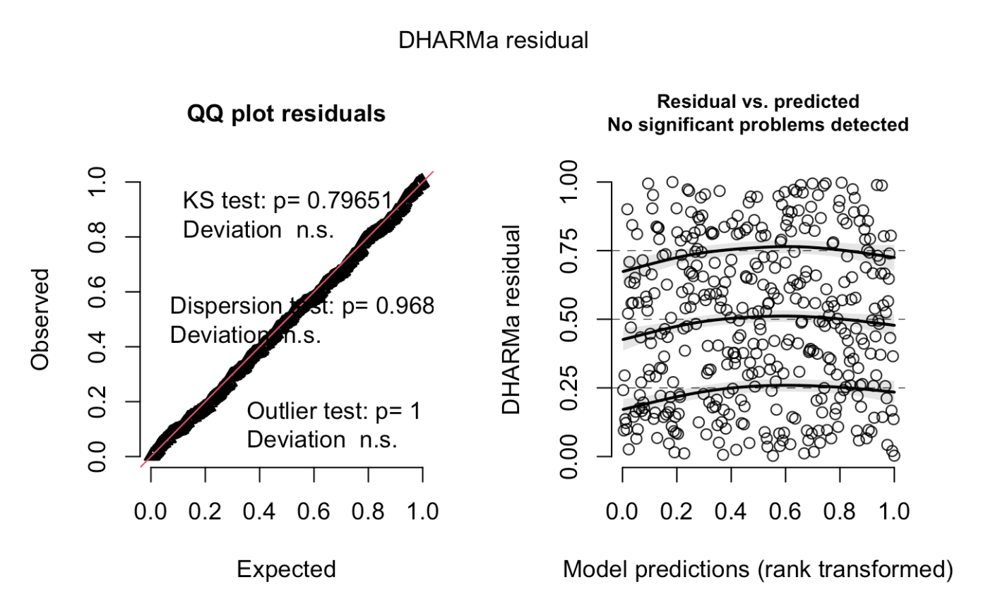

```{r setup, include=FALSE}
#Empezamos limpiando nuestro ambiente
rm(list = ls(all.names = TRUE))

# Configuración global de los bloques de código (chunk's)
knitr::opts_chunk$set(
	echo = FALSE,
	fig.align = "center",
	fig.dim = c(5.24,3.24),
	fig.pos = "H",
#Agregamos configuraciones para evitar mensajes de advertencias y de errores en el archivo
	message = FALSE,
	warning = FALSE,
	error = F
)


# Librerías
library(dplyr)      # Para el manejo de datos
library(ggplot2)    # Para realizar gráficas
library(kableExtra) # Para un mejor manejo de tablas
library(GGally)     # Para realizar análisis descriptivo fácilmente
library(multcomp)   # Para pruebas de hipótesis
library(car)        # Para funciones útiles de modelos de regresión lineal múltiple
library(broom)      # Para obtener los residuales estandarizados
library(DHARMa)     # Para la verificación de supuestos
library(ISLR)       # Para la base de datos
library(leaps)      # Para el cálculo de los mejores conjuntos de variables por diversos métodos
library(bestglm)    # Para obtener el mejor subconjunto
library(glmnet)     # Para utilizar la penalización Lasso


```

# Selección de Variables

Considere la base de datos PimaIndiansDiabetes2 del paquete mlbench, sólo las observaciones con respuesta en todas las variables. Suponga que el objetivo del estudio es usar las ocho variables clínicas observadas en las pacientes para estudiar cuáles de éstas, adicionales o en lugar de la variable glucose, son los factores que ayudan a modelar mejor la probabilidad de presentar o no diabetes (var diabetes).

## Solución:

Se nos solicitó realizar una regresión, para entender qué variables podrían ser las más influyentes en el diagnóstico de diabetes según algunas características clínicas y demográficas de la trribu Pima

Cargamos la base de datos y lo primero que observamos en los datos, es que tenemos múltiples datos sin información (*"NA"s*), por lo que, para el análisis se eliminarán dichas observaciones, como se indica anteriormente.

```{r Datos, include=FALSE}

# Cargamos la base de datos PimaIndiansDiabetes2 del paquete mlbench
library(mlbench)
data(PimaIndiansDiabetes2)
# Quitamos observaciones con NA
datos <- na.omit(PimaIndiansDiabetes2)
dim(datos)
str(datos)
as.factor(datos$diabetes)
```

Tras haber realizado nuestro preprocesamiento de los datos, comenzamos realizando un análisis descriptivo del comportamiento de la variable diabetes, a través de varias de las características obtenidas, una posible primera idea es que un mayor nivel de glucosa plasmática, puede ser un indicativo de presentar diabetes, veamos si estamos en la correcto a través de la siguiente gráfica:

```{r glucose1, echo=FALSE, fig.cap="Diabetes vs Glucosa"}

#Graficamos diabetes vs. glucosa
ggplot(data = datos,aes(x = diabetes, y = glucose)) +
  geom_boxplot( aes(fill= diabetes)) +
  scale_y_continuous(breaks = seq(80,200,10),limits = c(80,200)) +
  ggtitle("Boxplot Diabetes vs. Glucosa") +
  stat_summary(fun.y=mean, colour="darkred", geom="point", 
                           shape=18, size=3,show.legend = TRUE) +
  theme_gray() + 
  theme_update(plot.title = element_text(hjust = 0.5))
```

Como podemos ver en la figura \@ref(fig:glucose1), en efecto, las mujeres que presentan diabetes diagnosticada, tienen un mayor nivel de glucosa plasmática, donde el promedio (que se representa como el rombo rojo) para las mujeres que presentan diabetes es, más o menos, de 145, un valor bastante alto a comparción de las mujeres que no presentan diabetes.

También, podemos realizar el análisis de ver qué relación hay entre el índice de masa corporal y la edad con la diabetes, lo anterior se visualizará a través del siguiente scatter plot:

```{r scatterplot1, echo=FALSE, fig.cap="Relación entre edad, masa corporal y diabetes"}

#Realizamos nuestro scatter plot
ggplot(datos, aes(x = age, y = mass, color = diabetes)) +
  geom_point(alpha = 0.5) +
  xlab("Edad") + 
  ylab("Masa corporal") +
  ggtitle("Relación entre edad, masa corporal y diabetes") +
  theme_classic()
```

Podemos observar en la figura \@ref(fig:scatterplot1), que este gráfico nos muestra que el índice de masa corporal tiene una relación más fuerte con la presencia de diabetes que la edad de las pacientes, ya que podemos ver como los puntos de las pacientes que presentan diabetes se encuentran desplazados más hacia arriba (mayor índice de masa corporal) a comparación de las pacientes que no tienen diabetes, sin embargo, sí se puede notar como los puntos de las mujeres que no presentan diabetes se encuentran mayormente concentrados entre las edades 20-30, y en el caso de las mujeres que sí presentan diabetes, podemos observar cómo se encuentran más dispersos entre los 20 y 60 años.

Hecho todo el análisis anterior, procedemos a realizar nuestra búsqueda del mejor conjunto de variables.

i.  Considere un modelo para datos binarios con liga logit. Realice una selección de variables considerando sólo los efectos principales de las variables y usando: a) mejor subconjunto, b) un método stepwise y c) método lasso. En cada caso, presente el mejor modelo obtenido usando el criterio BIC.

Realizaremos los 3 métodos diferentes, donde mostraremos en la siguiente tabla, el BIC de el mejor modelo que se generó en cada caso.

```{r bs 1, warning=FALSE, include=FALSE}
#Realizamos nuestro proceso
bs1 <- bestglm(datos, family = binomial("logit"), IC = "BIC", method = "exhaustive")
summary(bs1$BestModel)
BIC(bs1$BestModel)
#Y ya con eso obtuvimos nuestras mejores 4 variables
```

```{r bf1, message=FALSE, include=FALSE}
#Para este proceso vamos a necesitar dos ajustes que servirán como cotas
fit_nulo1 <- glm(formula = diabetes ~ 1, family = binomial("logit"), data = datos)

fit_comp1 <- glm(formula = diabetes ~ ., family = binomial("logit"), data = datos)

#Con esas cotas, podemos proceder con nuestro proceso step
bf1 <- step(fit_nulo1, scope = list(lower = fit_nulo1, upper = fit_comp1), trace = FALSE, direction = "forward", k = log(dim(datos)[1])) #Para el BIC

summary(bf1)
BIC(bf1)
```

```{r Lasso1, warning=FALSE, include=FALSE}
#Para utilizar la penalización Lasso, debemos utilizar la matriz 
#diseño de nuestro modelo
X1 <- model.matrix(object = diabetes ~ .,data = datos)
#Le vamos a quitar el intercepto, pues glmnet ya lo agrega por default
X_aux1 <- X1[,-1]

#Además de lo anterior, debemos obtener la variable y 
Y1 <- datos$diabetes

#Construimos nuestro moelo con glmnet
lasso1 <- glmnet(X_aux1, Y1, family = binomial("logit"), nlambda = 100, relax = TRUE)

# Con el BIC
BIClasso1=-((lasso1$relaxed$nulldev)-lasso1$relaxed$nulldev * (1 - lasso1$relaxed$dev.ratio))+log(dim(datos)[1])*lasso1$relaxed$df
MinBIClasso1=which.min(BIClasso1)
coef(lasso1$relaxed)[,MinBIClasso1] 
#Analizando los coeficientes, construímos nuestro modelo
best_lasso1 <- glm(diabetes ~ glucose + mass + pedigree + age, family = binomial("logit"), data = datos)
summary(best_lasso1)
BIC(best_lasso1)
```

```{r tab, echo=FALSE, message=FALSE, warning=FALSE}
#Realizamos una tabla que contenga las formulas, el método utilizado, la familia, la liga y los BIC
Formula1<-c("$diabetes \\sim glucose + mass + pedigree + age$",
            "$diabetes \\sim glucose + mass + pedigree + age$",
            "$diabetes \\sim glucose + mass + pedigree + age$")
Proceso1<-c("Mejor subconjunto (Efectos principales)", "Step forward (Efectos principales)", "Optimización Lasso (Efectos principales)")
Familia1<-c("Binomial","Binomial", "Binomial")
Liga1<-c("Logit","Logit", "Logit")
BIC1<-c(BIC(bs1$BestModel),BIC(bf1),BIC(best_lasso1))
df1<-data_frame("Fórmula"=Formula1,"Proceso"=Proceso1, "Familia"=Familia1, "Liga"=Liga1, "BIC"=BIC1)
kable(df1,"latex", align = "c", booktabs=T, escape = F, caption="BIC de cada modelo obtenido mediante los procesos indicados") %>%
  kable_styling(latex_options = "HOLD_position")
```

(El proceso de cálculo de estos modelos y sus BIC se encuentran en los chunks *"bs1"*, *"bf1"* y *"Lasso 1"* )

Como podemos observar en el cuadro \@ref(tab:tab), todos los modelos obtenidos tienen el mismo BIC, lo cual no nos sirve para comparar dichos modelos, por lo que procedemos a la búsqueda de más modelos.

ii. Considere un modelo para datos binarios con liga logit. Realice una selección de variables considerando en el modelo los efectos principales de las variables, así como su interacción y el cuadrado de las variables, sólo considerando: a) un método stepwise y b) método lasso. En cada caso, presente el mejor modelo obtenido usando el criterio BIC.

Realicemos los siguientes modelos solicitados, donde a continuación, mostraremos la siguiente tabla con el BIC de el mejor modelo que se generó en cada método.

```{r bf2, message=FALSE, include=FALSE}
#Para este proceso vamos a necesitar dos ajustes que servirán como cotas
fit_nulo2 <- glm(formula = diabetes ~ 1, family = binomial("logit"), data = datos)

fit_comp2 <- glm(formula = diabetes ~ .^2 + I(pregnant^2)+I(glucose^2)+I(pressure^2)
                 +I(triceps^2)+I(insulin^2)+I(mass^2)+I(pedigree^2)+I(age^2), 
                 family = binomial("logit"), data = datos)

#Con esas cotas, podemso proceder con nuestro proceso step
bf2 <- step(fit_nulo2, scope = list(lower = fit_nulo2, upper = fit_comp2), trace = FALSE, direction = "forward", k = log(dim(datos)[1])) #Para el BIC

summary(bf2)
BIC(bf2)
```

```{r Lasso2, warning=FALSE, include=FALSE}
#Para utilizar la penalización Lasso, debemos utilizar la matriz
#diseño de nuestro modelo
X2 <- model.matrix(object = diabetes ~ .^2 + I(pregnant^2)+I(glucose^2)+I(pressure^2)
                   +I(triceps^2)+I(insulin^2)+I(mass^2)+I(pedigree^2)+I(age^2), 
                   data = datos)
#Le vamos a quitar el intercepto, pues glmnet ya lo agrega por default
X_aux2 <- X2[,-1]

Y2<-datos$diabetes


lasso2 <- glmnet(X_aux2, Y2, family = binomial("logit"), nlambda = 100, relax = TRUE)

# Con el BIC
BIClasso2=-((lasso2$relaxed$nulldev)-lasso2$relaxed$nulldev * (1 - lasso2$relaxed$dev.ratio))+log(dim(datos)[1])*lasso2$relaxed$df
MinBIClasso2=which.min(BIClasso2)
coef(lasso2$relaxed)[,MinBIClasso2] 
best_lasso2 <- glm(diabetes ~ I(glucose^2) + glucose:mass + glucose:age, family = binomial("logit"), data = datos)
summary(best_lasso2)
BIC(best_lasso2)
```

```{r tab2, echo=FALSE, message=FALSE, warning=FALSE}

#Realizamos una tabla que contenga las formulas, el método utilizado, la familia, la liga y los BIC
Formula2<-c("$diabetes \\sim glucose + mass + pedigree + age + I(age^2)$",
            "$diabetes \\sim glucose:mass + glucose:age +I(glucose^2)$")
Proceso2<-c("Step forward ($.^2 + I(variables)^2$)", 
            "Optimización Lasso ($.^2 + I(variables)^2$)")
Familia2<-c("Binomial","Binomial")
Liga2<-c("Logit","Logit")
BIC2<-c(BIC(bf2),BIC(best_lasso2))
df2<-data_frame("Fórmula"=Formula2,"Proceso"=Proceso2, "Familia"=Familia2, "Liga"=Liga2, "BIC"=BIC2)
kable(df2,"latex", align = "c", booktabs=T, escape = F, 
      caption="BIC de cada modelo obtenido mediante los procesos indicados") %>%
  kable_styling(latex_options = "HOLD_position")
```

(El proceso de cálculo de estos modelos y sus BIC se encuentran en los chunks *"bf2"* y *"Lasso 2"* )

Como podemos observar en la cuadro \@ref(tab:tab2), el mejor modelo según el criterio BIC, es el que fue obtenido por medio del método step forward, donde obtuvimos un *BIC=370.63* y, que hasta este punto, ha sido el mejor modelo encontrado.

iii. Considere posibles modificaciones a los incisos i) y ii) realizando lo siguiente. A) usar ligas probit o cloglog; B) usar el logaritmo como preprocesamiento a las variables. En cada caso, presente el mejor modelo obtenido usando el criterio BIC.
iv. Presente en una sola tabla los diferentes modelos obtenidos, así como el BIC de cada uno. Comente sobre los resultados, por ejemplo, qué variables aparecen en la mayoría de modelos, si parece necesario incluir interacciones o realizar un preprocesamiento a los datos y, considerando el mejor de todos, qué interpretación se puede dar a algunos de los coeficientes del modelo.

A continuación, en el siguiente cuadro \@ref(tab:tab3), se muestran todos los mejores modelos encontrados para este ejercicio por medio de los métodos *"Mejor Subconjunto", "Step forward" y "Optimización Lasso"*, es decir, los mostrados previamente en el *inciso i)* y *ii)*, más los que se piden en el *inciso iii),* observemos que se realizaron dos modelos extra, debido a que, en la mayoría de los casos, los modelos obtenidos por medio del *método step forward* son los que tienen un menor BIC, por lo que se probaron otros dos últimos modelos con el preprocesamiento, en el que se había aplicado logaritmo a las variables númericas, solo cambiando de liga: probit y cloglog, en donde se consideró los efectos principales, sus interacciones y las variables al cuadrado, es decir, $.^2 + I(variables)^2$

```{r probit, warning=FALSE, include=FALSE}


#### EFECTOS PRINCIPALES ####

### Mejor subconjunto ###
#Realizamos nuestro proceso
bs2 <- bestglm(datos, family = binomial("probit"), IC = "BIC", method = "exhaustive")
summary(bs2$BestModel)
BIC(bs2$BestModel)
#Y ya con eso obtuvimos nuestras mejores 4 variables


### Step forward ###
#Para este proceso vamos a necesitar dos ajustes que servirán como cotas
fit_nulo3 <- glm(formula = diabetes ~ 1, family = binomial("probit"), data = datos)

fit_comp3 <- glm(formula = diabetes ~ ., family = binomial("probit"), data = datos)

#Con esas cotas, podemso proceder con nuestro proceso step
bf3 <- step(fit_nulo3, scope = list(lower = fit_nulo3, upper = fit_comp3), trace = FALSE, direction = "forward", k = log(dim(datos)[1])) #Para el BIC

summary(bf3)
BIC(bf3)

### Lasso ###

#Para utilizar la penalización Lasso, debemos utilizar la matriz
#diseño de nuestro modelo

lasso3 <- glmnet(X_aux1, Y1, family = binomial("probit"), nlambda = 100, relax = TRUE)

# Con el BIC
BIClasso3=-((lasso3$relaxed$nulldev)-lasso3$relaxed$nulldev * (1 - lasso3$relaxed$dev.ratio))+log(dim(datos)[1])*lasso3$relaxed$df
MinBIClasso3=which.min(BIClasso3)
coef(lasso3$relaxed)[,MinBIClasso3]
best_lasso3 <- glm(diabetes ~ glucose + mass + age, family = binomial("probit"), data = datos)
summary(best_lasso3)
BIC(best_lasso3)


#### .^2 + I(variables)^2 ####

### Step forward ###
#Para este proceso vamos a necesitar dos ajustes que servirán como cotas
fit_nulo4 <- glm(formula = diabetes ~ 1, family = binomial("probit"), data = datos)

fit_comp4 <- glm(formula = diabetes ~ .^2 + I(pregnant^2)+I(glucose^2)+I(pressure^2)+I(triceps^2)+I(insulin^2)+I(mass^2)+I(pedigree^2)+I(age^2), family = binomial("probit"), data = datos)

#Con esas cotas, podemso proceder con nuestro proceso step
bf4 <- step(fit_nulo4, scope = list(lower = fit_nulo4, upper = fit_comp4), trace = FALSE, direction = "forward", k = log(dim(datos)[1])) #Para el BIC

summary(bf4)
BIC(bf4)


### Lasso ###

#Para utilizar la penalización Lasso, debemos utilizar la matriz
#diseño de nuestro modelo

lasso4 <- glmnet(X_aux2, Y2, family = binomial("probit"), nlambda = 100, relax = TRUE)

# Con el BIC
BIClasso4=-((lasso4$relaxed$nulldev)-lasso4$relaxed$nulldev * (1 - lasso4$relaxed$dev.ratio))+log(dim(datos)[1])*lasso4$relaxed$df
MinBIClasso4=which.min(BIClasso4)
coef(lasso4$relaxed)[,MinBIClasso4]
best_lasso4 <- glm(diabetes ~ I(glucose^2) + glucose:mass + glucose:age, family = binomial("probit"), data = datos)
summary(best_lasso4)
BIC(best_lasso4)

```

```{r clogclog, warning=FALSE, include=FALSE}

#### EFECTOS PRINCIPALES ####

### Mejor subconjunto ###
#Realizamos nuestro proceso
bs3 <- bestglm(datos, family = binomial("cloglog"), IC = "BIC", method = "exhaustive")
summary(bs3$BestModel)
BIC(bs3$BestModel)
#Y ya con eso obtuvimos nuestras mejores 4 variables


### Step forward ###
#Para este proceso vamos a necesitar dos ajustes que servirán como cotas
fit_nulo5 <- glm(formula = diabetes ~ 1, family = binomial("cloglog"), data = datos)

fit_comp5 <- glm(formula = diabetes ~ ., family = binomial("cloglog"), data = datos)

#Con esas cotas, podemso proceder con nuestro proceso step
bf5 <- step(fit_nulo5, scope = list(lower = fit_nulo5, upper = fit_comp5), trace = FALSE, direction = "forward", k = log(dim(datos)[1])) #Para el BIC

summary(bf5)
BIC(bf5)


### Lasso ###
#Para utilizar la penalización Lasso, debemos utilizar la matriz
#diseño de nuestro modelo

lasso5 <- glmnet(X_aux1, Y1, family = binomial("cloglog"), nlambda = 100, relax = TRUE)

# Con el BIC
BIClasso5=-((lasso5$relaxed$nulldev)-lasso5$relaxed$nulldev * (1 - lasso5$relaxed$dev.ratio))+log(dim(datos)[1])*lasso5$relaxed$df
MinBIClasso5=which.min(BIClasso5)
coef(lasso5$relaxed)[,MinBIClasso5]
best_lasso5 <- glm(diabetes ~ glucose + mass + age, family = binomial("cloglog"), data = datos)
summary(best_lasso5)
BIC(best_lasso5)


#### .^2 + I(variables)^2 ####

### Step forward ###
#Para este proceso vamos a necesitar dos ajustes que servirán como cotas
fit_nulo6 <- glm(formula = diabetes ~ 1, family = binomial("cloglog"), data = datos)

fit_comp6 <- glm(formula = diabetes ~ .^2 + I(pregnant^2)+I(glucose^2)+I(pressure^2)+I(triceps^2)+I(insulin^2)+I(mass^2)+I(pedigree^2)+I(age^2), family = binomial("cloglog"), data = datos)

#Con esas cotas, podemso proceder con nuestro proceso step
bf6 <- step(fit_nulo6, scope = list(lower = fit_nulo6, upper = fit_comp6), trace = FALSE, direction = "forward", k = log(dim(datos)[1])) #Para el BIC

summary(bf6)
BIC(bf6)


### Lasso ###

#Para utilizar la penalización Lasso, debemos utilizar la matriz
#diseño de nuestro modelo

lasso6 <- glmnet(X_aux2, Y2, family = binomial("cloglog"), nlambda = 100, relax = TRUE)

# Con el BIC
BIClasso6=-((lasso6$relaxed$nulldev)-lasso6$relaxed$nulldev * (1 - lasso6$relaxed$dev.ratio))+log(dim(datos)[1])*lasso6$relaxed$df
MinBIClasso6=which.min(BIClasso6)
coef(lasso6$relaxed)[,MinBIClasso6]
best_lasso6 <- glm(diabetes ~ I(glucose^2) + glucose:mass + glucose:age, family = binomial("cloglog"), data = datos)
summary(best_lasso6)
BIC(best_lasso6)
```

```{r log, warning=FALSE, include=FALSE}

# Usaremos la función log1p() de R.
# Esta función le suma 1 a cada valor antes de calcular el logaritmo. De esta forma se pueden manejar valores de 0 sin generar infinitos.

datos_log <- log1p(datos[, -9])  # Excluye la variable de respuesta 'diabetes'

# Añadir la variable de respuesta
datos_log$diabetes <- datos$diabetes


#### EFECTOS PRINCIPALES ####


### Mejor subconjunto ###
#Realizamos nuestro proceso
bs4 <- bestglm(datos_log, family = binomial, IC = "BIC", method = "exhaustive")
summary(bs4$BestModel)
BIC(bs4$BestModel)
#Y ya con eso obtuvimos nuestras mejores 4 variables


### Step forward ###
#Para este proceso vamos a necesitar dos ajustes que servirán como cotas
fit_nulo7 <- glm(formula = diabetes ~ 1, family = binomial, data = datos_log)

fit_comp7 <- glm(formula = diabetes ~ ., family = binomial, data = datos_log)

#Con esas cotas, podemso proceder con nuestro proceso step
bf7 <- step(fit_nulo7, scope = list(lower = fit_nulo7, upper = fit_comp7), trace = FALSE, direction = "forward", k = log(dim(datos_log)[1])) #Para el BIC

summary(bf7)
BIC(bf7)


### Lasso ###
#Para utilizar la penalización Lasso, debemos utilizar la matriz
#diseño de nuestro modelo

X1_1 <- model.matrix(object = diabetes ~ .,data = datos_log)
#Le vamos a quitar el intercepto, pues glmnet ya lo agrega por default
X_aux1_1 <- X1_1[,-1]

#Además de lo anterior, debemos obtener la variable y
Y1_1 <- datos_log$diabetes

lasso7 <- glmnet(X_aux1_1, Y1_1, family = binomial, nlambda = 100, relax = TRUE)

# Con el BIC
BIClasso7=-((lasso7$relaxed$nulldev)-lasso7$relaxed$nulldev * (1 - lasso7$relaxed$dev.ratio))+log(dim(datos_log)[1])*lasso7$relaxed$df
MinBIClasso7=which.min(BIClasso7)
coef(lasso7$relaxed)[,MinBIClasso7]
best_lasso7 <- glm(diabetes ~ glucose + mass + pedigree + age, family = binomial, data = datos_log)
summary(best_lasso7)
BIC(best_lasso7)


#### .^2 + I(variables)^2 ####

### Step forward ###
#Para este proceso vamos a necesitar dos ajustes que servirán como cotas
fit_nulo8 <- glm(formula = diabetes ~ 1, family = binomial, data = datos_log)

fit_comp8 <- glm(formula = diabetes ~ .^2 + I(pregnant^2)+I(glucose^2)+I(pressure^2)+
                   I(triceps^2)+I(insulin^2)+I(mass^2)+I(pedigree^2)+I(age^2),
                 family = binomial, data = datos_log)

#Con esas cotas, podemos proceder con nuestro proceso step
bf8 <- step(fit_nulo8, scope = list(lower = fit_nulo8, upper = fit_comp8), trace = FALSE, direction = "forward", k = log(dim(datos_log)[1])) #Para el BIC

summary(bf8)
BIC(bf8)


### Lasso ###

X2_2 <- model.matrix(object = diabetes ~ .^2 + I(pregnant^2)+I(glucose^2)+I(pressure^2)+I(triceps^2)+I(insulin^2)+I(mass^2)+I(pedigree^2)+I(age^2), data = datos_log)
#Le vamos a quitar el intercepto, pues glmnet ya lo agrega por default
X_aux2_2 <- X2_2[,-1]

Y2_2<-datos_log$diabetes

#Para utilizar la penalización Lasso, debemos utilizar la matriz
#diseño de nuestro modelo

lasso8 <- glmnet(X_aux2_2, Y2_2, family = binomial, nlambda = 100, relax = TRUE)

# Con el BIC
BIClasso8=-((lasso8$relaxed$nulldev)-lasso8$relaxed$nulldev * 
              (1 - lasso8$relaxed$dev.ratio))+log(dim(datos_log)[1])*lasso8$relaxed$df
MinBIClasso8=which.min(BIClasso8)
coef(lasso8$relaxed)[,MinBIClasso8]
best_lasso8 <- glm(diabetes ~ I(glucose^2) + glucose:mass + glucose:age + pedigree:age, 
                   family = binomial, data = datos_log)
summary(best_lasso8)
BIC(best_lasso8)

##EXTRA##

#Debido a que vemos que en la mayoría de los casos, los modelos obtenidos por medio del método step forward son los que tienen menor BIC, probemos otros dos últimos modelos con el preprocesamiento del logaritmo de las variables, solo cambiando de liga: probit y cloglog,  en donde se consideren los efectos principales, sus interacciones y las variables al cuadrado, es decir, .^2 + I(variables)^2


### Step forward ###
#Para este proceso vamos a necesitar dos ajustes que servirán como cotas
fit_nulo9 <- glm(formula = diabetes ~ 1, family = binomial("probit"), data = datos_log)

fit_comp9 <- glm(formula = diabetes ~ .^2 + I(pregnant^2)+I(glucose^2)+I(pressure^2)+
                   I(triceps^2)+I(insulin^2)+I(mass^2)+I(pedigree^2)+I(age^2),
                 family = binomial("probit"), data = datos_log)

#Con esas cotas, podemos proceder con nuestro proceso step
bf9 <- step(fit_nulo9, scope = list(lower = fit_nulo9, upper = fit_comp9), trace = FALSE, direction = "forward", k = log(dim(datos_log)[1])) #Para el BIC

summary(bf9)
BIC(bf9)

### Step forward ###
#Para este proceso vamos a necesitar dos ajustes que servirán como cotas
fit_nulo10 <- glm(formula = diabetes ~ 1, binomial("cloglog"), data = datos_log)

fit_comp10 <- glm(formula = diabetes ~ .^2 + I(pregnant^2)+I(glucose^2)+I(pressure^2)+
                   I(triceps^2)+I(insulin^2)+I(mass^2)+I(pedigree^2)+I(age^2),
                 binomial("cloglog"), data = datos_log)

#Con esas cotas, podemos proceder con nuestro proceso step
bf10 <- step(fit_nulo10, scope = list(lower = fit_nulo10, upper = fit_comp10), trace = FALSE, direction = "forward", k = log(dim(datos_log)[1])) #Para el BIC

summary(bf10)
BIC(bf10)
```

```{r tab3, echo=FALSE, message=FALSE, warning=FALSE}

#Realizamos una tabla que contenga las formulas, el método utilizado, la familia, la liga y los BIC

Formula3<-c("$diabetes \\sim glucose + mass + pedigree + age$",
            "$diabetes \\sim glucose + mass + pedigree + age$",
            "$diabetes \\sim glucose + mass + pedigree + age$",
            "$diabetes \\sim glucose + mass + pedigree + age + I(age^2)$",
            "$diabetes \\sim glucose:mass + glucose:age +I(glucose^2)$",
            "$diabetes \\sim glucose + mass + age$",
            "$diabetes \\sim glucose + mass + age$",
            "$diabetes \\sim glucose + mass + age$",
            "$diabetes \\sim glucose + mass + age + I(age^2)$",
            "$diabetes \\sim glucose:mass + glucose:age +I(glucose^2)$",
            "$diabetes \\sim pregnant + glucose + mass$",
            "$diabetes \\sim glucose + triceps + age$",
            "$diabetes \\sim glucose + mass + age$",
            "$diabetes \\sim glucose + mass + I(pregnant^2)$",
            "$diabetes \\sim glucose:mass + glucose:age +I(glucose^2)$",
            "$diabetes \\sim glucose + mass + pedigree + age$",
            "$diabetes \\sim glucose + mass + pedigree + age$",
            "$diabetes \\sim glucose + mass + pedigree + age$",
            "$diabetes \\sim mass + pedigree + age + I(glucose^2) + I(age^2)$",
            "$diabetes \\sim glucose:mass + glucose:age + pedigree:age + I(glucose^2)$",
            "$diabetes \\sim mass + pedigree + age + I(glucose^2) + I(age^2)$",
            "$diabetes \\sim glucose + mass + age + I(age^2)$")

Proceso3<-c("Mejor subconjunto (Efectos principales)", "Step forward (Efectos principales)", 
            "Optimización Lasso (Efectos principales)","Step forward ($.^2 + I(variables)^2$)",
            "Optimización Lasso ($.^2 + I(variables)^2$)", 
            "Mejor subconjunto (Efectos principales)", "Step forward (Efectos principales)", 
            "Optimización Lasso (Efectos principales)","Step forward ($.^2 + I(variables)^2$)",
            "Optimización Lasso ($.^2 + I(variables)^2$)",
            "Mejor subconjunto (Efectos principales)", "Step forward (Efectos principales)", 
            "Optimización Lasso (Efectos principales)", "Step forward ($.^2 + I(variables)^2$)",
            "Optimización Lasso ($.^2 + I(variables)^2$)",
            "Mejor subconjunto (Efectos principales) - log(variables predictoras)", 
            "Step forward (Efectos principales) - log(variables predictoras)", 
            "Optimización Lasso (Efectos principales) - log(variables predictoras)",
            "Step forward ($.^2 + I(variables)^2$) - log(variables predictoras)",
            "Optimización Lasso log($.^2 + I(variables)^2$) - log(variables predictoras)",
            "Step forward ($.^2 + I(variables)^2$) - log(variables predictoras)", 
            "Step forward ($.^2 + I(variables)^2$) - log(variables predictoras)")
Familia3<-c("Binomial","Binomial", "Binomial","Binomial","Binomial",
            "Binomial","Binomial", "Binomial","Binomial","Binomial",
            "Binomial","Binomial", "Binomial","Binomial","Binomial",
            "Binomial","Binomial", "Binomial","Binomial","Binomial",
            "Binomial","Binomial")
Liga3<-c("Logit","Logit", "Logit","Logit","Logit",
         "Probit","Probit", "Probit","Probit","Probit",
         "Cloglog","Cloglog", "Cloglog","Cloglog","Cloglog",
         "Logit","Logit", "Logit","Logit","Logit", "Probit", "Cloglog")
BIC3<-c(BIC(bs1$BestModel),BIC(bf1),BIC(best_lasso1),BIC(bf2),BIC(best_lasso2),
        BIC(bs2$BestModel),BIC(bf3),BIC(best_lasso3),BIC(bf4),BIC(best_lasso4),
        BIC(bs3$BestModel),BIC(bf5),BIC(best_lasso5),BIC(bf6),BIC(best_lasso6),
        BIC(bs4$BestModel),BIC(bf7),BIC(best_lasso7),BIC(bf8),BIC(best_lasso8),
        BIC(bf9), BIC(bf10))
df3<-data_frame("Fórmula"=Formula3,"Proceso"=Proceso3, "Familia"=Familia3, "Liga"=Liga3, "BIC"=BIC3)
kable(df3,"latex", align = "l", booktabs=T, escape = F, 
      caption="BIC de cada modelo obtenido mediante los procesos indicados") %>%
  kable_styling(latex_options = c("HOLD_position", "scale_down"))

```

(El proceso de cálculo de estos modelos y sus BIC se encuentran en los chunks *"probit"* ,*"cloglog"* y *"log"* )

Analizando el cuadro \@ref(tab:tab3), podemos ver que en todos los modelos, las variables que más predominan son: glucose (*Concentración de glucosa plasmática*) , mass (*Índice de masa corporal*) y age (*Edad en años*), justo las variables que intuíamos en un principio que podían ser relevantes para determinar si una paciente podría tener diabetes o no.

Parece que haber considerado modelos con interacciones y términos cuadráticos de las variables, ayudó a reducir el valor del BIC, aunque no demasiado, existiendo un caso en el que inclusive, el mejor modelo encontrado por medio del *mejor subconjunto* considerando únicamente efectos principales es mejor que los modelos que también consideran interacciones y las variables al cuadrado (*óbservese los modelos con* *Liga Cloglog)*.

Sin embargo, sí tuvo un mayor efecto realizar un preprocesamiento a las variables predictoras (todas siendo numéricas) aplicando logaritmo, donde justamente encontramos el mejor modelo dentro de todos los realizados por medio del criterio BIC, el cual es el siguiente:

```{r sum, include=FALSE}
#Vemos el resumen de nuestro modelo
summary(bf8)
BIC(bf8)
```

```{r fig1, echo=FALSE, out.width="250px", fig.cap="Resumen del modelo elegido"}

```

Interpretando los coeficientes del modelo que se observan en la figura \@ref(fig:fig1) tenemos que:

-   I(glucose\^2): El efecto cuadrático de glucose es positivo y altamente significativo. Esto indica que altas concentraciones de glucosa plásmatica están fuertemente asociados con mayor probabilidad de diabetes.

    Y al ser un término cuadrático, nos indica que la probabilidad de tener diabetes podría dispararse rápidamente conforme la concentración de glucosa plasmática aumenta.

-   mass (IMC) y pedigree (que investigando, es una función que cuantifica la predisposición genética de cada paciente a desarrollar diabetes, con base en el historial en la familia), nos indica que al ambas tener un valor positivo, sugiere que valores más altos en estas variables, incrementan la probabilidad de tener diabetes.

-   I(age\^2) y age: El signo negativo de este término cuadrático de la edad, en conjunto con el positivo de la edad simple, nos está indicando una relación parabólica invertida (forma de U invertida). Es decir, que el riesgo de diabetes aumentaría con la edad hasta un punto máximo, y luego empezaría a decaer.

    A partir de la figura \@ref(fig:fig2), parece no haber evidencia en contra de los supuestos, por lo que el modelo es adecuado para utilizarse.

    ```{r Supuestos, include=FALSE}
    #Verificamos supuestos
    set.seed(123)
    plot(simulateResiduals(bf8))
    ```

    ```{r fig2, echo=FALSE, out.width="300px", fig.cap="Verificación de Supuestos"}
    
    ```
