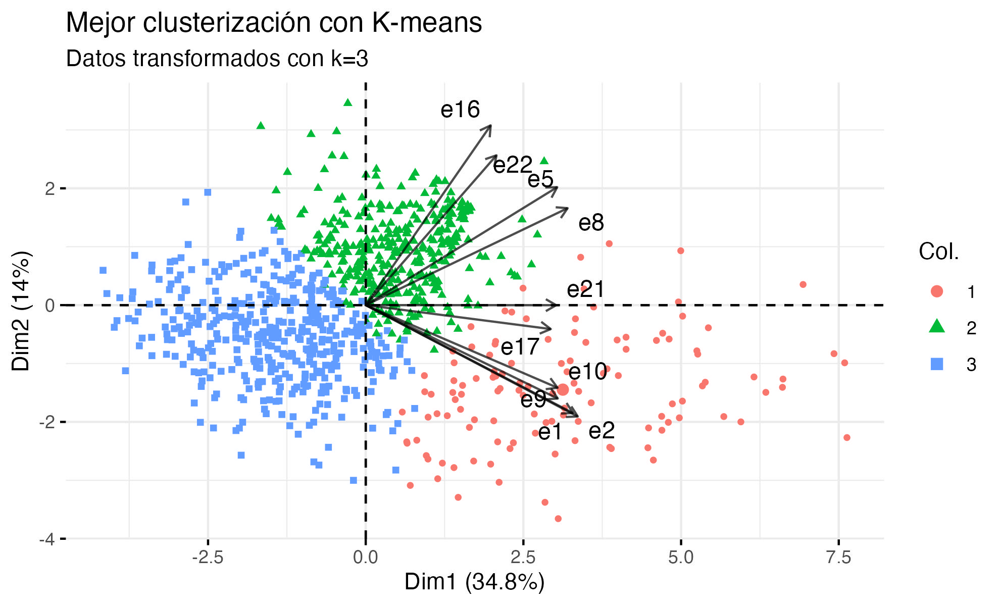
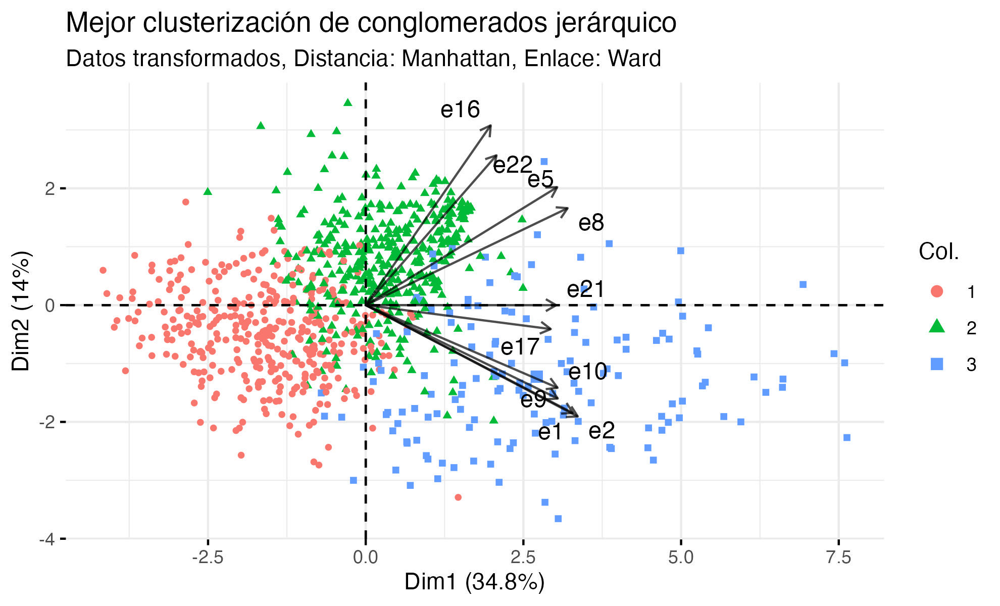
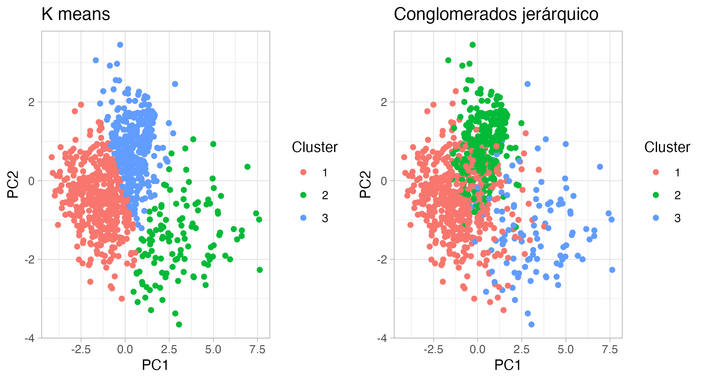
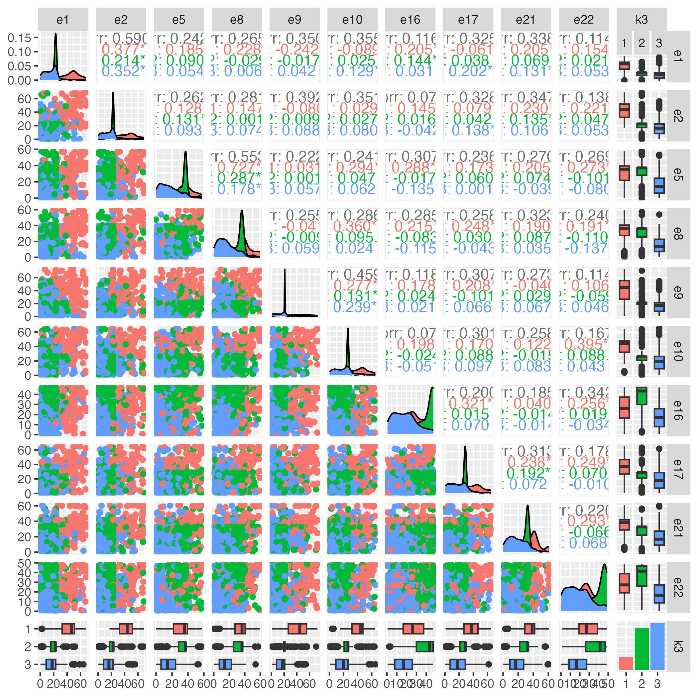

```{r, include=FALSE, echo=FALSE, warning=FALSE}
# Establecer directorio de la sesión
# Saltar si no es necesario
```

```{r setup, include=FALSE}
#Limpieza del environment
rm(list = ls(all.names = TRUE))
gc()

# Configuración global de los bloques de código (chunk's)
knitr::opts_chunk$set(
	echo = FALSE,
	fig.align = "center",
	fig.dim = c(6.0, 5.0),
	fig.pos = "H",
#Agregamos configuraciones para evitar mensajes de advertencias y de errores en el archivo
	message = FALSE,
	warning = FALSE,
	error = F
)

# Paquetes a usar
library(multcomp)
library(DHARMa)
library(ggResidpanel)
library(ggplot2)
library(broom)
library(MASS)
library(car)
library(VGAM)
library(lessR)
library(tidyverse)
library(plotly)     
library(kableExtra)
library(gridExtra)
library(factoextra)
library(NbClust)
library(GGally)
library(psych)
library(clusterCrit)
library(cluster)
```

```{=tex}
\begin{center}
  {\huge \textbf{4. Análisis de conglomerados}}
\end{center}

\setcounter{figure}{13}
\setcounter{table}{8}
```
```{r pre-procesamiento, include=FALSE, echo=FALSE, warning=FALSE}
# Cargamos el archivo con los datos
datos4 <- read.csv('Dat4ExB.csv')
# Quitamos renglones con NA
datos4 <- na.omit(datos4)
# Quitamos el índice de las observaciones que no nos sirve
datos4$X <- NULL 

mu_col <- apply(datos4, MARGIN = 2, FUN = mean) #Media de cada columna
sig_col <-apply(datos4, MARGIN = 2, FUN = sd) #Desv. Est. de cada columna

datos4_transf <- datos4 # Hacemos una copia del dataframe para transformar los datos

# Transformación de los datos, se inicio restando la media y diviviendo entre la desviación estándar de cada columna y de ahí se fue "jugando" para encontrar una interpretación clara de los grupos
for (i in 1:length(datos4)){
  datos4_transf[, colnames(datos4_transf)[i]] <- abs(datos4[,colnames(datos4)[i]]-mu_col[i])*datos4[,colnames(datos4)[i]]^(1/3)/sig_col[i]^(1/3)
}
# Estructura de los datos
str(datos4_transf)
```

Para hacer clustering con k-means la primera cuestión que surge es el número de grupos a considerar en los datos. En la tabla \@ref(tab:indices-result) se presentan los clusters sugeridos por distintos tipos de índices.

```{r indices-nbclust, include=FALSE, echo=TRUE, warning=FALSE}
# Se calcula el valor de k bajo distintos indices
k_clust <- NbClust(data = datos4, distance = "euclidean", min.nc = 2,
                  max.nc = 6, method = "kmeans", index = "all")

####el mejor para saber el numero de clusters#####
library(parameters)

n_clust <- n_clusters(datos4_transf,
  package = c("easystats", "NbClust", "mclust"),
  standardize = FALSE
)
n_clust

n_clust2 <- n_clusters(datos4,
  package = c("easystats", "NbClust", "mclust"),
  standardize = FALSE
)
n_clust2
```

```{r indices-result, include=TRUE, echo=FALSE, warning=FALSE, fig.cap="Indices para selección de K"}
# Tablas donde se presentan los k sugeridos por algunos indices
k_clust$Best.nc[,1:8] %>% 
  kable(booktabs = T, 
        align = "c", 
        linesep = "",
        caption = "Indices para selección de K") %>%
  kable_styling(latex_options = "HOLD_position", full_width = FALSE) %>%
  row_spec(1, bold = TRUE)

k_clust$Best.nc[,9:17] %>% 
  kable(booktabs = T, 
        align = "c", 
        linesep = "") %>%
  kable_styling(latex_options = "HOLD_position", full_width = FALSE) %>%
  row_spec(1, bold = TRUE)

```

El valor sugerido en la mayoría de estos índices es $k=2$ (entre ellos algunos de los populares como $Silhouette$ y $Duda$), pero también hay algunos como $Hartigan$ y $TrCovW$ que sustentan usar $k=3$.

```{r kmeans-orig, include=FALSE, echo=FALSE, warning=FALSE}
# Se aplica K-means con k=2
kmeans.origk2 <- kmeans(x = datos4, centers = 2, nstart = 200)
# Se aplica K-means con k=3
kmeans.origk3 <- kmeans(x = datos4, centers = 3, nstart = 200)

# Se asignan los clusters en nuevas variables del dataframe
datos4$k2 <- kmeans.origk2$cluster
datos4$k3 <- kmeans.origk3$cluster
```

```{r pca-orig, include=FALSE, echo=FALSE, warning=FALSE}
# Se hace PCA con las variables de la encuesta
R.CP.orig <- prcomp(select(datos4, c(-k2, -k3)), scale = TRUE)
```

```{r pca-result-orig, echo=FALSE, warning=FALSE}
# Biplot de PCA con k=2 (datos originales)
biplot_origk2 <- fviz_pca_biplot(R.CP.orig, geom.ind = "point", repel=TRUE,
           col.ind = as.factor(datos4$k2), col.var="black", alpha.var=0.7,
           axes = c(1, 2), 
           pointsize = 1.2,
           subtitle="Datos originales con k=2") 

# Biplot de PCA con k=3 (datos originales)
biplot_origk3 <- fviz_pca_biplot(R.CP.orig, geom.ind = "point", repel=TRUE,
           col.ind = as.factor(datos4$k3), col.var="black", alpha.var=0.7,
           axes = c(1, 2), 
           pointsize = 1.2,
           subtitle="Datos originales con k=3") 
```

```{r kmeans-transf, include=FALSE, echo=FALSE, warning=FALSE}
# Se aplica K-means con k=2
kmeans.transfk2 <- kmeans(x = datos4_transf, centers = 2, nstart = 200)
# Se aplica K-means con k=3
kmeans.transfk3 <- kmeans(x = datos4_transf, centers = 3, nstart = 200)

# Se asignan los clusters en nuevas variables del dataframe
datos4_transf$k2 <- kmeans.transfk2$cluster
datos4_transf$k3 <- kmeans.transfk3$cluster
```

```{r pca-transf, include=FALSE, echo=FALSE, warning=FALSE}
# Se hace PCA con las variables de la encuesta
R.CP.transf <- prcomp(select(datos4_transf, c(-k2, -k3)), scale = TRUE)
```

Después de explorar los casos de $k=2$ y $k=3$ en los datos originales, no se obtuvieron resultados con interpretación significativa (chunk: $pca-result-orig$), ya que sólo se separaban los grupos en individuos que le dan importancia a todas las variables o a ninguna. Dado esto, se optó por hacer alguna transformación \footnote{Para cada columna $X$, se realizó $T(X)=|X-\mu_X|\left(\frac{X}{\sigma_X}\right)^{1/3}$} útil para obtener una mejor distribución de los grupos. En la figura \@ref(fig:pca-result-transf) se presentan los clusters obtenidos con $k=3$ en los datos transformados, con los cuales se obtuvieron los mejores resultados.

```{r pca-result-transf, include=TRUE, echo=FALSE, warning=FALSE, fig.cap="Clusters obtenidos con k-means."}
# Biplot de PCA con k=2 (datos transformados)
biplot_transfk2 <- fviz_pca_biplot(R.CP.transf, geom.ind = "point", repel=TRUE,
           col.ind = as.factor(datos4_transf$k2), col.var="black", alpha.var=0.7,
           axes = c(1, 2),
           subtitle="Datos transformados con k=2",
           pointsize = 1.2)

# Biplot de PCA con k=3 (datos transformados)
biplot_transfk3 <- fviz_pca_biplot(R.CP.transf, geom.ind = "point", repel=TRUE,
           col.ind = as.factor(datos4_transf$k3), col.var="black", alpha.var=0.7,
           axes = c(1, 2), 
           pointsize = 1.2,
           title="Mejor clusterización con K-means",
           subtitle="Datos transformados con k=3") 

ggsave("plot1_Ej4.jpg", biplot_transfk3, width = 6.6, height = 4)
# Se incluye la imagen del gráfico en el pdf generado

```

Una alternativa a k-means es aplicar el método de conglomerados jerárquico aglomerativo. Para probar una amplia gamma de opciones, en este se consideraron 3 distancias: euclideana, manhattan y canberra, para medir la disimilaridad entre las observaciones. Para la disimilaridad entre clusters se consideraron las ligas: average, complete, Ward, centroid y median. De esta forma, se obtuvieron 15 pares de distancias y disimilaridades a probar en cada dataset (datos originales y datos transformados), por lo tanto, se evaluaron 30 modelos de aglomeración distintos.

```{r metodos-jerar, include=FALSE}
# Lista para guardar las múltples matrices de distancias 
distancias <- list()
# Vector con las distancias a usar
dists <- c("euclidean", "manhattan", "canberra")
# Se generan las matrices de distancias para ambos conjuntos de datos
for (i in 1:3){
distancias[[paste0("dis_datos_orig", i)]] <- dist(x = select(datos4, c(-k2, -k3)), method=dists[i])
distancias[[paste0("dis_datos_transf", i)]] <- dist(x = select(datos4_transf, c(-k2, -k3)), method=dists[i])
}
# Lista para guardar las múltples aglomeraciones que se probaran
metodos <- list()
# Vector con las disimilaridades para definir los clusters
disim <- c("average", "complete", "ward.D", "centroid", "median")

# Se aplica la funcion hclust() con cada par de distancias y dismilaridad
for (i in 1:3){
  for (j in 1:5){
 X <- distancias[[paste0("dis_datos_orig", i)]]
 metodos[[paste0("clust.jer.orig", i, j)]] <- hclust(X, method=disim[j])
 Y <- distancias[[paste0("dis_datos_transf", i)]]
 metodos[[paste0("clust.jer.transf", i, j)]] <- hclust(Y, method=disim[j])
}}

# Nombres de las nuevas columnas donde se guardaran los clusters
newcols <- c(
  paste0("hc", seq(11, 15)),
  paste0("hc", seq(21, 25)),
  paste0("hc", seq(31, 35))
)

# Guardamos en los dataframes las columnas con cada aglomeracion obtenida
for (col in newcols) {
  X = metodos[[paste0("clust.jer.orig", substr(col, 3,4))]]
  datos4[[col]] <- cutree(X, k = 3)
  Y = metodos[[paste0("clust.jer.transf", substr(col, 3,4))]]
  datos4_transf[[col]] <- cutree(Y, k = 3)
}
```

```{r eval-metodos-jerar, include=FALSE}
# Lista para guardar el índice de silhouette en cada aglomeracion
silhouettes <- list()

# Se guardan los indices de los métodos con los datos originales
for (i in 1:3){
  for (j in 1:5){
silhouettes[paste0("clust.jer.orig", i, j)] <-  
intCriteria(as.matrix(select(as.data.frame(lapply(datos4, as.numeric), stringsAsFactors = FALSE), c(e1,e2,e5,e8,e9,e10,e16,e17,e21,e22))), as.integer(datos4[[paste0("hc", i, j)]]), c("Silhouette"))
  }}
# Se guardan los indices de los métodos con los datos transformados
for (i in 1:3){
  for (j in 1:5){
silhouettes[paste0("clust.jer.transf", i, j)] <-  
intCriteria(as.matrix(select(as.data.frame(lapply(datos4_transf, as.numeric), stringsAsFactors = FALSE), c(e1,e2,e5,e8,e9,e10,e16,e17,e21,e22))), datos4_transf[[paste0("hc", i, j)]], c("Silhouette"))
  }}

silhouettes
# En realidad los métodos con mejor índice no nos sirven mucho :(
```

```{r dendogramas, echo=FALSE}
# Optamos por revisar uno a uno los dendogramas
for (i in 1:3){
  for (j in 1:5){
plot(metodos[[paste0("clust.jer.orig", i, j)]], labels=FALSE, sub=paste0("Datos originales, Distancia: ", dists[i], ", Enlace: ", disim[j]))
rect.hclust(metodos[[paste0("clust.jer.orig", i, j)]] , k = 3, border = 2:6) 
}}

for (i in 1:3){
  for (j in 1:5){
plot(metodos[[paste0("clust.jer.transf", i, j)]], labels=FALSE, sub=paste0("Datos transf, Distancia: ", dists[i], ", Enlace: ", disim[j]))
rect.hclust(metodos[[paste0("clust.jer.transf", i, j)]] , k = 3, border = 2:6) 
  }}

d <- dist(datos4_transf,  #uso del data fame estandarizado
          method = "euclidean") # genera una matriz de distancias
fit2 <- hclust(d, #aplicación del método jerárquico
              method = "ward.D")
plot(fit2) # crear dendograma
f<-rect.hclust(fit2, 
            k = 3, #definición de la cantidad de cluster a mapear en el dendograma
            border = "red") 
```

Después de revisar los clusters obtenidos por cada método (chunk: $dendogramas$), se observa que en general los resultados convenientes para la interpretación son los obtenidos con el enlace Ward. Esta clusterización se presenta en el espacio de los componentes principales de los datos transformados, lo cual se encuentra en la figura \@ref(fig:mejor-jerar).

```{r mejor-jerar, include=TRUE, echo=FALSE, warning=FALSE, fig.cap="Clusters obtenidos con el método de conglomerados jerárquico."}
biplot_transfhc23 <- fviz_pca_biplot(R.CP.transf, geom.ind = "point", repel=TRUE,
           col.ind = as.factor(datos4_transf$hc23), col.var="black", alpha.var=0.7,
           axes = c(1, 2), 
           pointsize = 1.2,
           title="Mejor clusterización de conglomerados jerárquico",
           subtitle="Datos transformados, Distancia: Manhattan, Enlace: Ward")

ggsave("plot2_Ej4.jpg", biplot_transfhc23, width = 6.6, height = 4)
# Se incluye la imagen del gráfico en el pdf generado

```

Por otro lado, también se exploró la posibilidad de aplicar tanto k-means como el método de aglomeración jerárquica con los componentes principales de los datos (y no con los datos per se). Para esto se seleccionaron suficientes componentes para recuperar almenos el 80% de la varianza en cada conjunto de datos.

```{r pca, include=FALSE, echo=FALSE, warning=FALSE}
# Se hace PCA con las variables de la encuesta
R.CP.orig <- prcomp(select(datos4, c(e1,e2,e5,e8,e9,e10,e16,e17,e21,e22)), scale = TRUE)
# Se hace PCA con las variables de la encuesta (datos transformados)
R.CP.transf <- prcomp(select(datos4_transf, c(e1,e2,e5,e8,e9,e10,e16,e17,e21,e22)), scale = TRUE)

# Vemos con cuantos componentes nos conviene trabajar
summary(R.CP.orig)
summary(R.CP.transf)
```

```{r nuevos-kmeans, include=FALSE, echo=FALSE, warning=FALSE}
# Se crean dataframes con los componentes principales
datos4_origpca <- select(data.frame(R.CP.orig$x), c(PC1, PC2, PC3, PC4, PC5))
datos4_transfpca <- select(data.frame(R.CP.transf$x), c(PC1, PC2, PC3, PC4, PC5, PC6))
# Se aplica k means con los nuevos dataframes
kmeans_origpca <- kmeans(x = datos4_origpca, centers = 3, nstart = 200)
kmeans_transfpca <- kmeans(x = datos4_transfpca, centers = 3, nstart = 200)
# Se agregan las etiquetas de los clusters resultates de kmeans
datos4_origpca$pcak3 <- factor(kmeans_origpca$cluster)
datos4_transfpca$pcak3 <- factor(kmeans_transfpca$cluster)
```

```{r nuevos-kmeans-grafs, include=FALSE, echo=FALSE, warning=FALSE}
# Visualizamos los clusters del nuevo kmeans en el espacio de los 2 primeros componentes
nuevokmean_origk3 <- ggplot(datos4_origpca, aes(PC1, PC2)) + geom_point(aes(color=pcak3))

nuevokmean_transfk3 <- ggplot(datos4_transfpca, aes(PC1, PC2)) + geom_point(aes(color=pcak3)) +
  theme_light() + guides(color = guide_legend(title = "Cluster")) +
  ggtitle("K means")
```

```{r nuevos-jerar, include=FALSE, echo=FALSE, warning=FALSE}
# Matrices de distancias (sólo manhattan)
dis_datos_origpca <- dist(x = select(datos4_origpca, c(-pcak3)), method="manhattan")
dis_datos_transfpca <- dist(x = select(datos4_transfpca, c(-pcak3)), method="manhattan")
# Se realiza el hclust (sólo enlace Ward)
clust.jer.origpca <- hclust(dis_datos_origpca, method="ward.D2")
clust.jer.transfpca <- hclust(dis_datos_transfpca, method="ward.D2")
# Se guardan las etiquetas en los dataframes
datos4_origpca$pcahc <- as.factor(cutree(clust.jer.origpca, k=3))
datos4_transfpca$pcahc <- as.factor(cutree(clust.jer.transfpca, k=3))
```

```{r nuevos-jerar-grafs, include=FALSE, echo=FALSE, warning=FALSE}
# Visualizamos los clusters del nuevo jerarquico en el espacio de los 2 primeros componentes
nuevojerar_orighc <- ggplot(datos4_origpca, aes(PC1, PC2)) + geom_point(aes(color=pcahc)) 

nuevojerar_transfhc <- ggplot(datos4_transfpca, aes(PC1, PC2)) + geom_point(aes(color=pcahc)) +
  theme_light() + guides(color = guide_legend(title = "Cluster")) +
  ggtitle("Conglomerados jerárquico")

#Juntamos los mejores nuevos resultados con ambos metodos
nuevospca_grafs <- grid.arrange(nuevokmean_transfk3, nuevojerar_transfhc, ncol = 2)
```

En la figura \@ref(fig:nuevospca-graficas), se presentan los clusters resultantes de ambos métodos tomando los componentes principales, en esta se observa que se obtuvieron resultados muy similares a los primeros dos.

```{r nuevospca-graficas, include=TRUE, fig.cap="Clusters obtenidos al aplicar kmeans (izquierda) y método jerárquico (derecha) sobre los componentes principales."}
ggsave("plot3_Ej4.jpg", nuevospca_grafs, width = 7.4, height = 4)
# Se incluye la imagen del gráfico en el pdf generado

```

Con todo lo anterior, es más claro en la figura \@ref(fig:pca-result-transf) analizar los clusters para realizar una descripción de los clientes, ya que en este vemos como el primer cluster (rosa) se orienta principalmente en el sentido de las variables $e5, e8, e16$ y $e22$; las cuales en conjunto describen la variedad de alimentos y servicios de entretenimiento, además de la comodidad y satisfacción con el viaje. Por lo tanto en este primer cluster se encuentran las personas que le dan más importancia a estos aspectos. Por otro lado, los individuos del cluster 3 (azul) se encuentran en el sentido de las variables $e1, e2, e9$ y $e10$; las cuales en general se pueden interpretar como un grupo al que le importa más la seguridad y la llegada puntual en los vuelos (sin retrasos ni imprevistos). Estos dos clusters, tienen en común también una importancia positiva en las variables $e17$ y $e21$, que indican la calidad del servicio (hospitalario y sin complicaciones). Por último, esta el cluster 2 (verde) que se encuentra directamente opuesto a las variables $e17$ y $e21$, por lo que a estos individuos no les parece tan importante estos aspectos y además en los demás se encuentran con una orientación media, por lo que se podrían considerar como un grupo neutro en ese sentido.

```{r ggpairs-graf, include=FALSE, fig.cap="Análisis descriptivo por grupo."}
datos4_transf$k3 <- as.factor(datos4_transf$k3)
ggpairs_graf <- ggpairs(data=select(datos4_transf, c(e1,e2,e5,e8,e9,e10,e16,e17,e21,e22, k3)), aes(colour = k3), lower = list(continuous = "points", cor = "blank", combo = "box"), upper = list(combo = "box"))

ggsave("plot4_Ej4.jpg", ggpairs_graf, width = 7, height = 7)
# Se incluye la imagen del gráfico en el pdf generado

```
